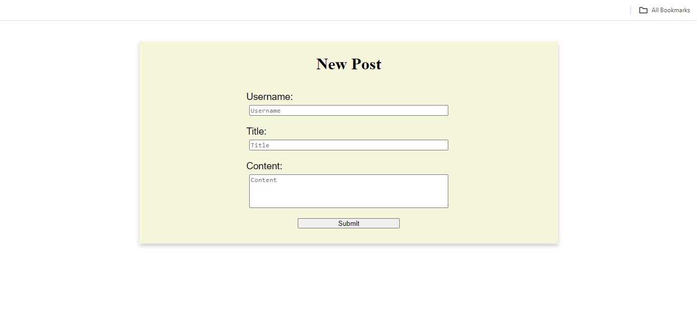
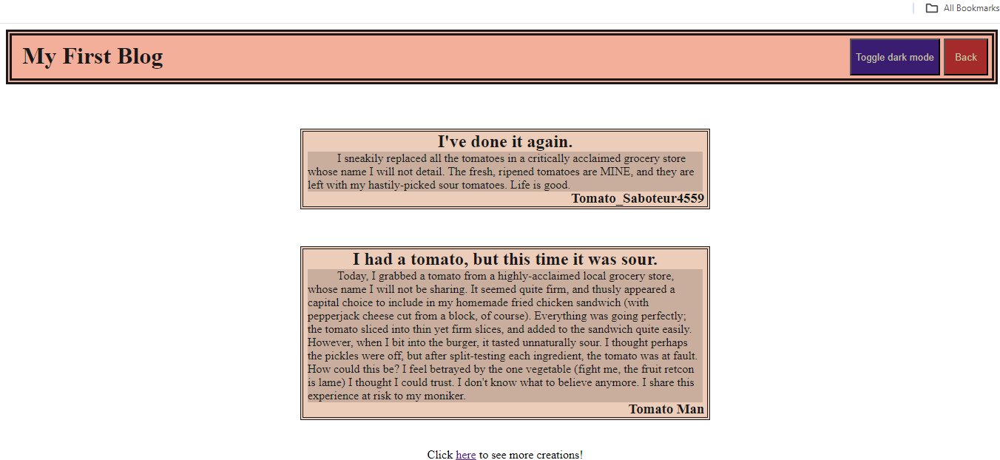

# my-personal-blog

## features:
Input username, title, and content to create a blog post.
Submit button will take you to a posts page, with a header containing a dark mode toggle and a back button.
Posts will be generated based off of content saved in local storage (username, title, content of prior and all past posts).
Posts page has a footer with a link to the developer's portfolio.

